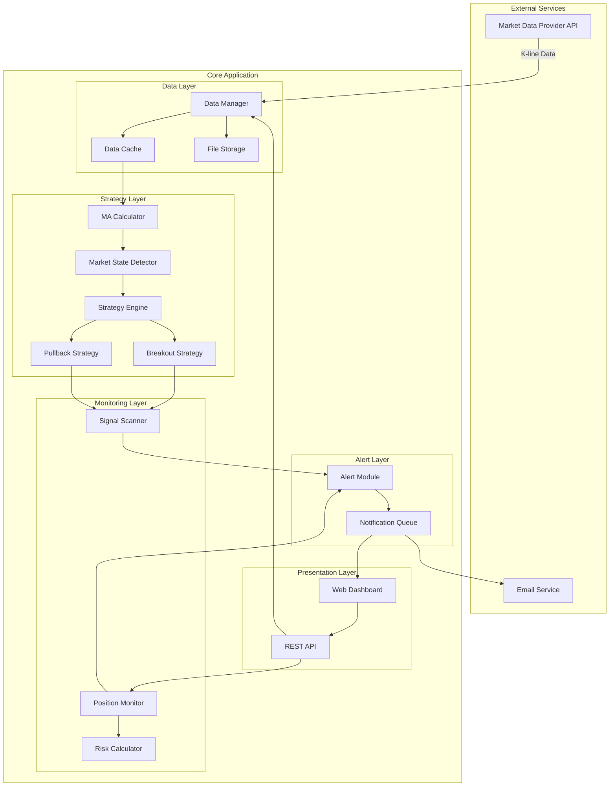

# 设计文档 - 股票交易监控和提醒系统

## Overview

股票交易监控和提醒系统是一个基于双均线MA策略的实时监控工具，采用Node.js/TypeScript实现。系统核心功能包括：实时市场数据获取、6条移动平均线计算（MA20/60/120和EMA20/60/120）、两种开仓策略识别（均线密集突破和趋势回踩MA20）、持仓监控、以及多渠道提醒通知。

系统设计遵循单进程架构，无需外部数据库依赖，所有数据存储在本地文件系统。**同时支持股票（A股/美股）和虚拟货币（BTC/ETH/SOL等）**的中线交易（1H、4H周期）。

核心设计原则：
- 趋势跟随策略，追求高盈亏比（1:3至1:5）
- 严格的风险管理，单笔最大亏损控制在账户的1%-2%
- 实时计算和提醒，确保不错过交易机会
- 模块化设计，便于扩展新的策略和数据源

## Architecture

### 系统架构图



### 架构层次说明

1. **Data Layer（数据层）**
   - Data Manager: 负责从Market Data Provider获取K线数据，处理API调用、重试逻辑和错误处理
   - Data Cache: 内存缓存，存储最近120个周期的K线数据，用于快速计算均线
   - File Storage: 本地文件存储，持久化历史数据、配置、持仓记录和信号历史

2. **Strategy Layer（策略层）**
   - MA Calculator: 计算6条移动平均线（MA20/60/120, EMA20/60/120）
   - Market State Detector: 识别均线密集（Consolidation）和发散（Expansion）状态
   - Strategy Engine: 策略执行引擎，协调各个策略模块
   - Breakout Strategy: 实现策略A - 均线密集突破开仓法
   - Pullback Strategy: 实现策略B - 趋势中首次回踩MA20

3. **Monitoring Layer（监控层）**
   - Signal Scanner: 在开盘期间扫描所有配置的标的，识别买入机会
   - Position Monitor: 监控用户持仓，跟踪盈亏状态
   - Risk Calculator: 计算止损止盈位和建议仓位

4. **Alert Layer（提醒层）**
   - Alert Module: 生成和发送提醒通知
   - Notification Queue: 提醒队列，防止重复提醒，支持多种通知渠道

5. **Presentation Layer（展示层）**
   - Web Dashboard: 基于Web的用户界面，展示实时数据、持仓、信号和配置
   - REST API: 提供HTTP接口供前端调用

### 技术栈选择

- **运行时**: Node.js 18+ (支持ES2022特性)
- **语言**: TypeScript 5.x (严格模式)
- **数据获取**: axios (HTTP客户端)
- **数据存储**: 本地JSON文件 + 内存缓存
- **Web框架**: Express.js (轻量级REST API)
- **前端**: 简单的HTML/CSS/JavaScript (无需复杂框架)
- **测试**: Vitest (单元测试和属性测试)
- **邮件**: nodemailer (可选的邮件通知)

## Components and Interfaces

### 1. Data Manager

负责市场数据的获取、缓存和持久化。

```typescript
interface KLineData {
  timestamp: number;        // Unix时间戳（毫秒）
  open: number;            // 开盘价
  high: number;            // 最高价
  low: number;             // 最低价
  close: number;           // 收盘价
  volume: number;          // 成交量
}

enum MarketType {
  CRYPTO = 'crypto',      // 虚拟货币
  STOCK_CN = 'stock_cn',  // A股
  STOCK_US = 'stock_us'   // 美股
}

interface MarketDataProvider {
  readonly type: MarketType;
  readonly name: string;
  
  // 获取K线数据
  fetchKLines(
    symbol: string,         // 标的符号，如 "BTC/USDT", "600519.SH", "AAPL"
    interval: string,       // 时间周期，如 "1h", "4h"
    limit: number          // 获取数量
  ): Promise<KLineData[]>;
  
  // 获取最新价格
  fetchLatestPrice(symbol: string): Promise<number>;
  
  // 检查是否在交易时间（股票需要，虚拟货币始终返回true）
  isTradingTime(): boolean;
}

// 虚拟货币数据提供者 - Binance
class BinanceProvider implements MarketDataProvider {
  readonly type = MarketType.CRYPTO;
  readonly name = 'Binance';
  
  async fetchKLines(symbol: string, interval: string, limit: number): Promise<KLineData[]>;
  async fetchLatestPrice(symbol: string): Promise<number>;
  isTradingTime(): boolean { return true; } // 24/7交易
}

// 虚拟货币数据提供者 - OKX
class OKXProvider implements MarketDataProvider {
  readonly type = MarketType.CRYPTO;
  readonly name = 'OKX';
  
  async fetchKLines(symbol: string, interval: string, limit: number): Promise<KLineData[]>;
  async fetchLatestPrice(symbol: string): Promise<number>;
  isTradingTime(): boolean { return true; }
}

// A股数据提供者 - Tushare
class TushareProvider implements MarketDataProvider {
  readonly type = MarketType.STOCK_CN;
  readonly name = 'Tushare';
  private apiToken: string;
  
  async fetchKLines(symbol: string, interval: string, limit: number): Promise<KLineData[]>;
  async fetchLatestPrice(symbol: string): Promise<number>;
  isTradingTime(): boolean; // 检查是否在 9:30-15:00
}

// 美股数据提供者 - Yahoo Finance
class YahooFinanceProvider implements MarketDataProvider {
  readonly type = MarketType.STOCK_US;
  readonly name = 'Yahoo Finance';
  
  async fetchKLines(symbol: string, interval: string, limit: number): Promise<KLineData[]>;
  async fetchLatestPrice(symbol: string): Promise<number>;
  isTradingTime(): boolean; // 检查是否在 9:30-16:00 ET
}

class DataManager {
  private cache: Map<string, KLineData[]>;
  private providers: Map<MarketType, MarketDataProvider>;
  
  // 注册数据提供者
  registerProvider(provider: MarketDataProvider): void;
  
  // 根据标的符号自动选择提供者
  private selectProvider(symbol: string): MarketDataProvider;
  
  // 获取K线数据（优先从缓存）
  async getKLines(symbol: string, interval: string, limit: number): Promise<KLineData[]>;
  
  // 更新K线数据
  async updateKLines(symbol: string, interval: string): Promise<void>;
  
  // 保存历史数据到文件
  async saveToFile(symbol: string, interval: string): Promise<void>;
  
  // 从文件加载历史数据
  async loadFromFile(symbol: string, interval: string): Promise<void>;
}
```

### 2. MA Calculator

计算移动平均线。

```typescript
interface MAResult {
  ma20: number;
  ma60: number;
  ma120: number;
  ema20: number;
  ema60: number;
  ema120: number;
}

class MACalculator {
  // 计算简单移动平均线
  calculateSMA(prices: number[], period: number): number;
  
  // 计算指数移动平均线
  calculateEMA(prices: number[], period: number): number;
  
  // 计算所有6条均线
  calculateAll(klines: KLineData[]): MAResult;
  
  // 批量计算历史均线值
  calculateHistory(klines: KLineData[]): MAResult[];
}
```

### 3. Market State Detector

识别市场状态（密集/发散）。

```typescript
enum MarketState {
  CONSOLIDATION = 'consolidation',  // 均线密集
  EXPANSION_BULL = 'expansion_bull', // 多头发散
  EXPANSION_BEAR = 'expansion_bear', // 空头发散
  UNKNOWN = 'unknown'
}

interface MarketStateInfo {
  state: MarketState;
  stdDev: number;           // 6条均线的标准差
  range: number;            // 6条均线的极差
  isBullish: boolean;       // 是否多头排列
  isBearish: boolean;       // 是否空头排列
}

class MarketStateDetector {
  private consolidationThreshold: number;
  
  // 检测市场状态
  detectState(maResult: MAResult): MarketStateInfo;
  
  // 计算均线标准差
  private calculateStdDev(values: number[]): number;
  
  // 检查是否多头排列
  private isBullishAlignment(maResult: MAResult): boolean;
  
  // 检查是否空头排列
  private isBearishAlignment(maResult: MAResult): boolean;
}
```

### 4. Strategy Engine

策略执行引擎。

```typescript
enum SignalType {
  BUY_BREAKOUT = 'buy_breakout',       // 突破做多
  SELL_BREAKOUT = 'sell_breakout',     // 突破做空
  BUY_PULLBACK = 'buy_pullback',       // 回踩做多
  SELL_PULLBACK = 'sell_pullback',     // 回踩做空
}

interface TradingSignal {
  type: SignalType;
  symbol: string;
  timestamp: number;
  price: number;              // 触发价格
  stopLoss: number;           // 止损价
  takeProfit: number[];       // 止盈价（可能多个）
  reason: string;             // 触发原因描述
  confidence: number;         // 信号强度（0-1）
}

class StrategyEngine {
  private breakoutStrategy: BreakoutStrategy;
  private pullbackStrategy: PullbackStrategy;
  
  // 分析单个标的
  async analyze(
    symbol: string,
    klines: KLineData[],
    maHistory: MAResult[],
    stateInfo: MarketStateInfo
  ): Promise<TradingSignal | null>;
  
  // 批量扫描标的
  async scanSymbols(symbols: string[]): Promise<TradingSignal[]>;
}
```

### 5. Breakout Strategy

策略A：均线密集突破开仓法。

```typescript
class BreakoutStrategy {
  // 检测突破信号
  detectSignal(
    klines: KLineData[],
    maHistory: MAResult[],
    stateInfo: MarketStateInfo
  ): TradingSignal | null;
  
  // 检查是否处于密集状态
  private isInConsolidation(stateInfo: MarketStateInfo): boolean;
  
  // 检测向上突破后回踩
  private detectBullishBreakout(
    klines: KLineData[],
    maHistory: MAResult[]
  ): TradingSignal | null;
  
  // 检测向下突破后反弹
  private detectBearishBreakout(
    klines: KLineData[],
    maHistory: MAResult[]
  ): TradingSignal | null;
  
  // 计算密集区边界
  private calculateConsolidationBounds(maResult: MAResult): { upper: number; lower: number };
}
```

### 6. Pullback Strategy

策略B：趋势中首次回踩MA20。

```typescript
class PullbackStrategy {
  // 检测回踩信号
  detectSignal(
    klines: KLineData[],
    maHistory: MAResult[],
    stateInfo: MarketStateInfo
  ): TradingSignal | null;
  
  // 检测上涨趋势中的回踩
  private detectBullishPullback(
    klines: KLineData[],
    maHistory: MAResult[]
  ): TradingSignal | null;
  
  // 检测下跌趋势中的反弹
  private detectBearishPullback(
    klines: KLineData[],
    maHistory: MAResult[]
  ): TradingSignal | null;
  
  // 检查是否首次回踩
  private isFirstPullback(klines: KLineData[], ma20Values: number[]): boolean;
  
  // 检查是否有效跌破/突破
  private isEffectiveBreak(price: number, ma20: number): boolean;
}
```

### 7. Position Monitor

持仓监控器。

```typescript
interface Position {
  id: string;
  symbol: string;
  entryPrice: number;
  entryTime: number;
  quantity: number;
  strategyType: SignalType;
  stopLoss: number;
  takeProfit: number[];
  status: 'open' | 'closed';
}

interface PositionStatus {
  position: Position;
  currentPrice: number;
  pnl: number;              // 盈亏金额
  pnlPercent: number;       // 盈亏百分比
  shouldStopLoss: boolean;
  shouldTakeProfit: boolean;
  trendReversed: boolean;
}

class PositionMonitor {
  private positions: Map<string, Position>;
  
  // 添加持仓
  addPosition(position: Position): void;
  
  // 更新持仓状态
  async updatePositions(): Promise<PositionStatus[]>;
  
  // 检查单个持仓
  checkPosition(position: Position, currentPrice: number, maResult: MAResult): PositionStatus;
  
  // 关闭持仓
  closePosition(positionId: string, closePrice: number, reason: string): void;
  
  // 获取所有持仓
  getAllPositions(): Position[];
}
```

### 8. Risk Calculator

风险计算器。

```typescript
enum TakeProfitMode {
  FIXED_RATIO = 'fixed_ratio',           // 固定盈亏比
  PREVIOUS_CONSOLIDATION = 'prev_consol', // 前一密集区
  FIBONACCI = 'fibonacci'                 // 斐波那契扩展
}

interface RiskCalculation {
  stopLoss: number;
  takeProfit: number[];
  positionSize: number;      // 建议开仓数量
  riskAmount: number;        // 风险金额
  rewardAmount: number;      // 预期收益
  riskRewardRatio: number;   // 盈亏比
  leverage: number;          // 实际杠杆
  warning?: string;          // 风险警告
}

class RiskCalculator {
  private maxRiskPerTrade: number;  // 单笔最大亏损
  private accountBalance: number;    // 账户余额
  
  // 计算风险参数
  calculate(
    signal: TradingSignal,
    mode: TakeProfitMode,
    ratio?: number
  ): RiskCalculation;
  
  // 计算止损位
  calculateStopLoss(signal: TradingSignal): number;
  
  // 计算止盈位
  calculateTakeProfit(
    signal: TradingSignal,
    mode: TakeProfitMode,
    ratio?: number
  ): number[];
  
  // 计算仓位大小
  calculatePositionSize(entryPrice: number, stopLoss: number): number;
  
  // 计算实际杠杆
  calculateLeverage(positionValue: number): number;
}
```

### 9. Alert Module

提醒模块。

```typescript
enum AlertType {
  BUY_SIGNAL = 'buy_signal',
  SELL_SIGNAL = 'sell_signal',
  STOP_LOSS = 'stop_loss',
  TAKE_PROFIT = 'take_profit',
  TREND_REVERSAL = 'trend_reversal',
  ERROR = 'error'
}

interface Alert {
  id: string;
  type: AlertType;
  symbol: string;
  timestamp: number;
  message: string;
  data: any;              // 附加数据
  sent: boolean;
}

interface NotificationChannel {
  name: string;
  enabled: boolean;
  send(alert: Alert): Promise<void>;
}

class AlertModule {
  private channels: NotificationChannel[];
  private alertHistory: Alert[];
  private recentAlerts: Map<string, number>;  // 防重复
  
  // 创建提醒
  createAlert(type: AlertType, symbol: string, message: string, data?: any): Alert;
  
  // 发送提醒
  async sendAlert(alert: Alert): Promise<void>;
  
  // 检查是否重复
  private isDuplicate(alert: Alert): boolean;
  
  // 获取提醒历史
  getAlertHistory(limit?: number): Alert[];
}
```

### 10. Configuration Manager

配置管理器。

```typescript
interface SystemConfig {
  // 监控配置
  symbols: string[];                    // 监控标的列表（支持混合：["BTC/USDT", "600519.SH", "AAPL"]）
  intervals: string[];                  // 监控周期
  
  // 数据源配置
  providers: {
    binance?: { enabled: boolean };
    okx?: { enabled: boolean };
    tushare?: { enabled: boolean; apiToken: string };
    yahooFinance?: { enabled: boolean };
  };
  
  // 策略配置
  consolidationThreshold: number;       // 密集判断阈值
  takeProfitMode: TakeProfitMode;      // 止盈模式
  takeProfitRatio: number;             // 盈亏比
  
  // 风险配置
  maxRiskPerTrade: number;             // 单笔最大亏损
  maxLeverage: number;                 // 最大杠杆
  accountBalance: number;              // 账户余额
  
  // 提醒配置
  enableSound: boolean;                // 声音提醒
  enableEmail: boolean;                // 邮件提醒
  emailAddress?: string;               // 邮件地址
  
  // 数据配置
  dataRetentionDays: number;           // 数据保留天数
  updateInterval: number;              // 更新间隔（秒）
}

class ConfigManager {
  private config: SystemConfig;
  private configPath: string;
  
  // 加载配置
  async load(): Promise<SystemConfig>;
  
  // 保存配置
  async save(config: SystemConfig): Promise<void>;
  
  // 验证配置
  validate(config: SystemConfig): boolean;
  
  // 获取默认配置
  getDefault(): SystemConfig;
}
```

## Data Models

### 文件存储结构

系统使用本地JSON文件存储数据，目录结构如下：

```
data/
├── config.json                 # 系统配置
├── klines/                     # K线历史数据
│   ├── crypto/                 # 虚拟货币数据
│   │   ├── BTC_USDT_1h.json
│   │   ├── BTC_USDT_4h.json
│   │   └── ETH_USDT_1h.json
│   └── stock/                  # 股票数据
│       ├── 600519_SH_1h.json   # A股
│       ├── AAPL_1h.json        # 美股
│       └── AAPL_4h.json
├── positions/                  # 持仓记录
│   ├── open.json              # 当前持仓
│   └── history.json           # 历史持仓
├── signals/                    # 信号历史
│   └── signals_2024_01.json   # 按月存储
└── alerts/                     # 提醒历史
    └── alerts_2024_01.json    # 按月存储
```

### K线数据文件格式

```json
{
  "symbol": "BTC/USDT",
  "interval": "1h",
  "lastUpdate": 1704067200000,
  "data": [
    {
      "timestamp": 1704067200000,
      "open": 42000.5,
      "high": 42500.0,
      "low": 41800.0,
      "close": 42300.0,
      "volume": 1234.56
    }
  ]
}
```

### 持仓记录文件格式

```json
{
  "positions": [
    {
      "id": "pos_20240101_001",
      "symbol": "BTC/USDT",
      "entryPrice": 42000.0,
      "entryTime": 1704067200000,
      "quantity": 0.1,
      "strategyType": "buy_breakout",
      "stopLoss": 41000.0,
      "takeProfit": [45000.0, 48000.0, 51000.0],
      "status": "open"
    }
  ]
}
```

### 信号历史文件格式

```json
{
  "month": "2024-01",
  "signals": [
    {
      "type": "buy_breakout",
      "symbol": "BTC/USDT",
      "timestamp": 1704067200000,
      "price": 42000.0,
      "stopLoss": 41000.0,
      "takeProfit": [45000.0, 48000.0, 51000.0],
      "reason": "突破密集区后回踩支撑",
      "confidence": 0.85
    }
  ]
}
```

### 内存缓存结构

为提高性能，系统在内存中维护以下缓存：

```typescript
// K线数据缓存（最近120个周期）
Map<string, KLineData[]>  // key: "BTC/USDT_1h"

// 均线计算结果缓存
Map<string, MAResult[]>   // key: "BTC/USDT_1h"

// 市场状态缓存
Map<string, MarketStateInfo>  // key: "BTC/USDT_1h"

// 最近提醒缓存（1小时内）
Map<string, number>       // key: "alert_type_symbol", value: timestamp
```

